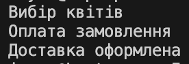

# Template-Method
Ідея шаблонного методу: 

Шаблонний метод задає загальний порядок дій (алгоритм), а підкласи можуть перевизначати кроки.

Як працює код: 

У нас є процес оформлення замовлення: вибір -> оплата -> доставка.
Якщо з’явиться “самовивіз” чи “передоплата” — можна змінити лише частину.

Навіщо: 

зручно, коли алгоритм один, але деталі різні.

## Код
```csharp
using System;

class OrderProcess
{
    public void Process()
    {
        SelectFlowers();
        Pay();
        Deliver();
    }

    protected void SelectFlowers() => Console.WriteLine("Вибір квітів");
    protected void Pay() => Console.WriteLine("Оплата замовлення");
    protected void Deliver() => Console.WriteLine("Доставка оформлена");
}

class Program
{
    static void Main()
    {
        new OrderProcess().Process();
    }
}
```
## Результат

